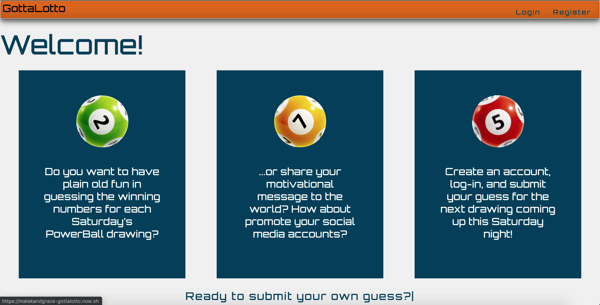
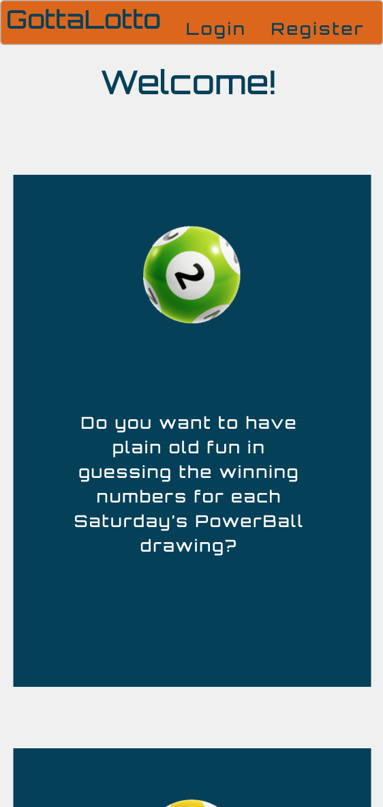
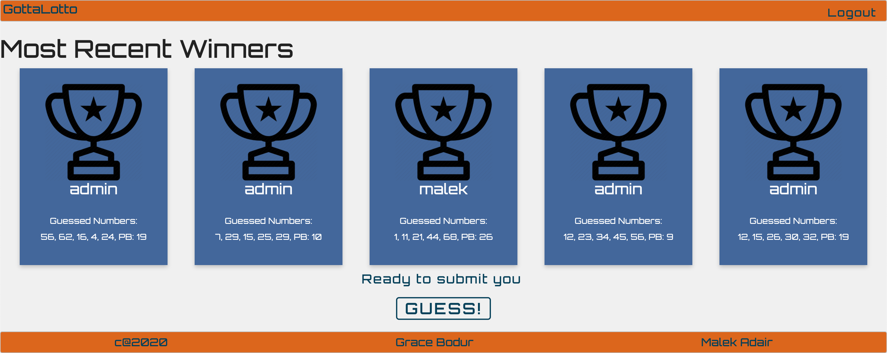
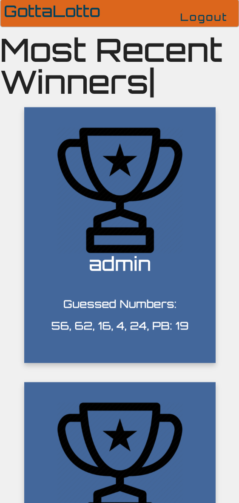
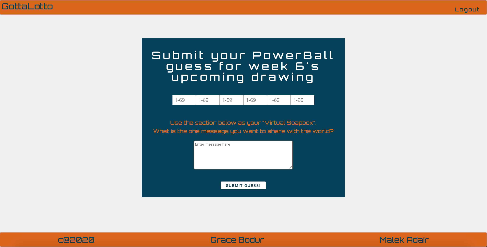
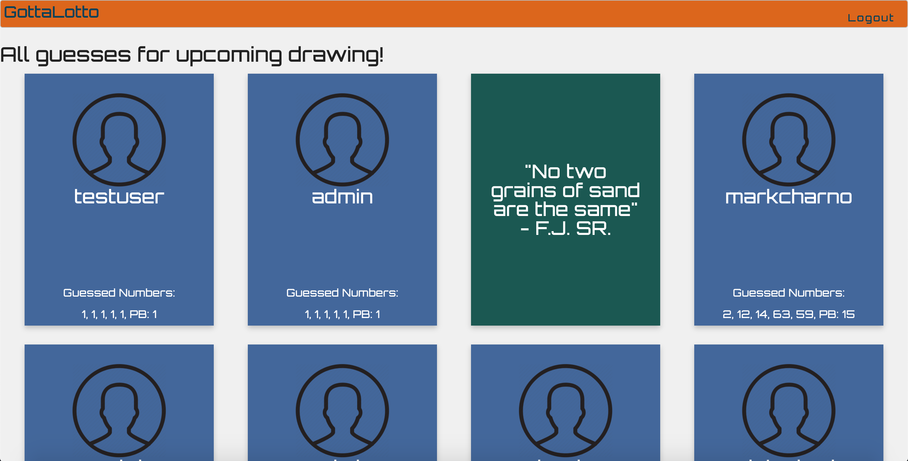
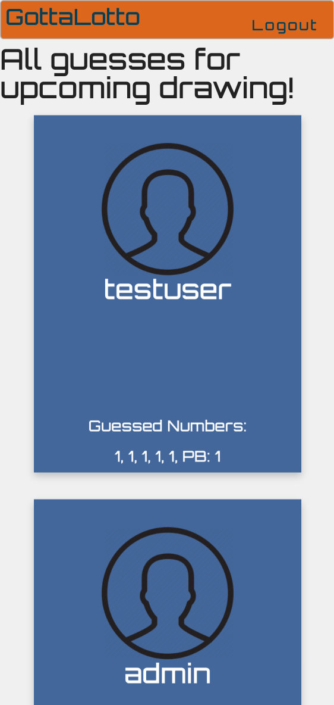

# App Name: GottaLotto

Author: [Malek Adair](https://github.com/malekadair) and [Marie Grace Bodur](https://github.com/gracebodur)

---

Live app: [GottaLotto](https://malekandgrace-gottalotto.now.sh/)

## About GottaLotto

The project allows you to create guesses for the upcoming PowerBall Drawing each Saturday. The app will take all guesses from the previous week and compare them to find out which guess was closest. Once the winning guess is found, it will display in a Winners List on the homepage for all to see their Username, Guess, and their "Message to the World".

If not logged in, the main page displays a welcome section which explains the app and prompts you to create an account and subit a guess.

If not logged in, you are given an option to either create an acocunt, or login to a previously created account. We have routes for both forms (login/register).

Once logged in, the main page displayes previous winning drawings and the "Message to the World" associated with it.

The Guess route will take you to a form to submit your guess for the the upcoming drawing. This controlled form includes 6 input values and a message textarea for the user to include their "Message to the World"

After successfully submitting a guess, you will be redirected to the Guess List route which displays your guess as well as all other guesses for the upcoming drawing.

## Application Features

## Screenshots

## Technologies used

#### Front-end technologies:

- Reactjs
- React-flippy
- React-typical
- Javascript
- HTML5
- CSS3

#### Back-end technologies:

- Express.js
- Node.js
- PostgreSQL
- Node-fetch
- Cron job

## Links:

API Documentation: [GottaLotto API](https://github.com/gracebodur/gottalotto-api.git)

## Setting Up

- Install dependencies: `npm install`

## Scripts

- Start the application for development: `npm start`
